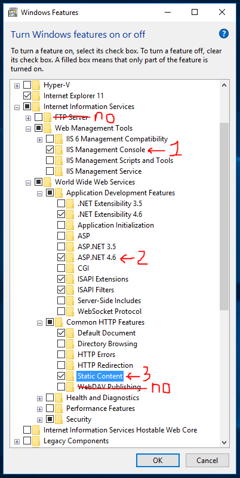

IIS (Web Server)
================

Internet Information Services (IIS) is the web server that comes bundled with Windows.

Install
-------

1. Start -> Type `Windows Features` to launch `Turn Windows features on or off`.

2. Inside `Internet Information Services`, inside `Web Management Tools`, turn on `IIS Management Console`.

3. Inside `Internet Information Services`, inside `World Wide Web Services`, inside `Application Development Features` turn on `ASP.NET 4.7` (or the version bundled with your OS).  Many other things will turn on when you choose this.

   

4. You may choose to turn on other settings in `Internet Information Services` such as Logging.

5. Ensure that these settings are **OFF** to avoid security risks:

- Inside `World Wide Web Services` ensure `WebDAV Publishing` is **OFF**.

- Ensure `FTP Server` is **OFF**.

6. Push OK to start the install.

Test it out
-----------

1. Open a browser and navigate to [localhost](http://localhost).

2. You should see the "Welcome to IIS" page.

Configure
---------

By default, IIS creates a default website which may get in your way later on.

1. Start -> `Internet Information Services (IIS)`.

2. Open up Sites

3. Right-click on Default Web Site and click Remove.

4. Click on Application Pools.

5. Right click on each application pool listed and click Remove.

Once you do this, browsing to [localhost](http://localhost) will give you a "connection refused" page.
