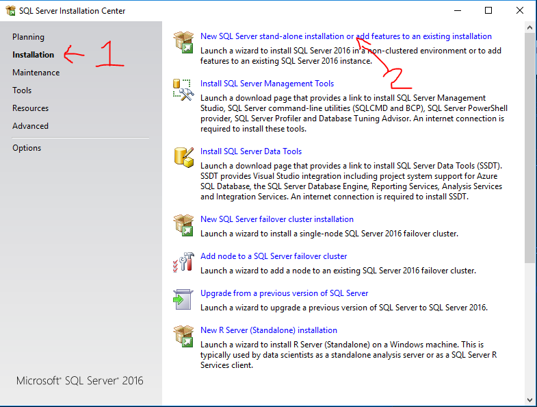
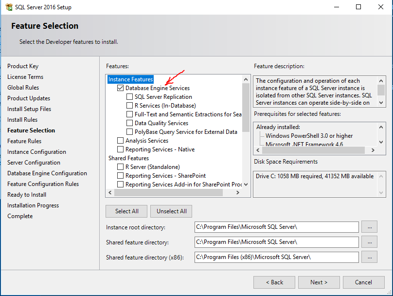
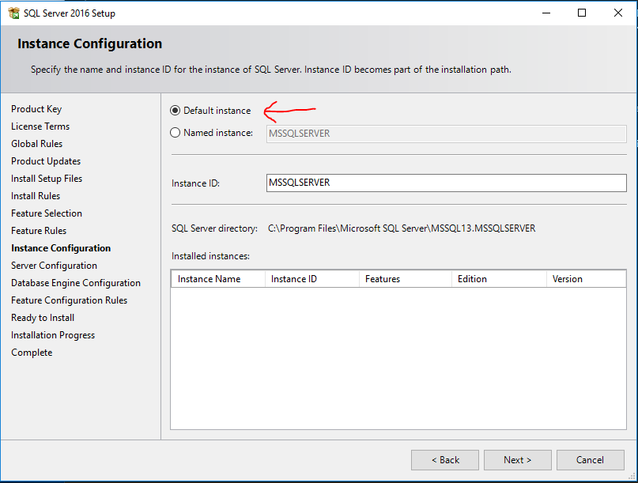
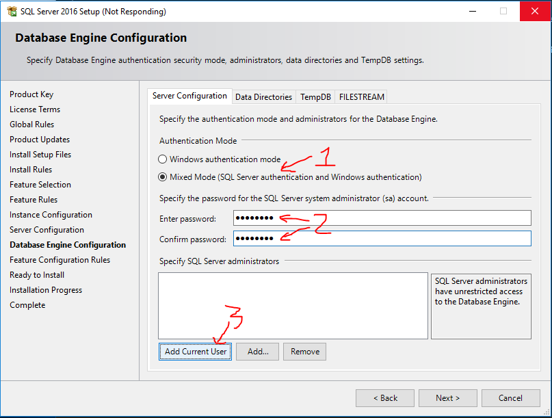
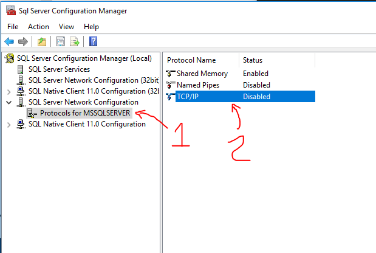
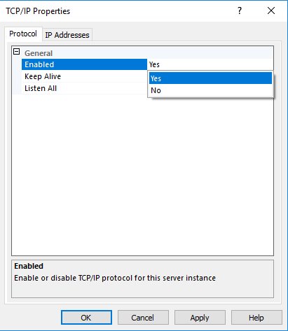
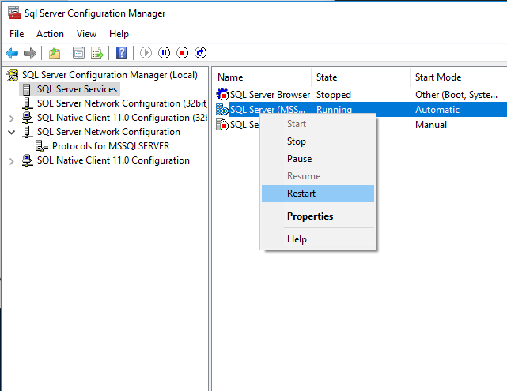
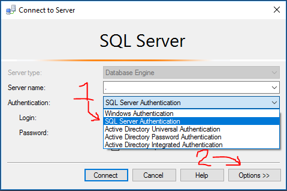
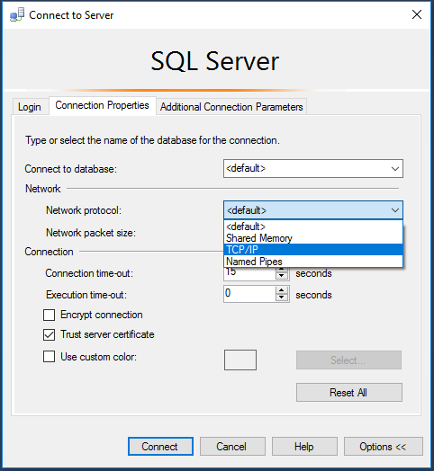

SQL SERVER DEVELOPER EDITION
============================

Starting in March 2016, SQL Server Developer Edition is now a free download.  We'll use SQL Developer Edition here because SQL Express doesn't have SQL Agent, useful for scheduling maintenance tasks.  See also https://blogs.technet.microsoft.com/dataplatforminsider/2016/03/31/microsoft-sql-server-developer-edition-is-now-free/

Install
-------

1. Download [SQL Server 2017 Developer Edition](https://www.microsoft.com/en-us/sql-server/sql-server-downloads)

2. Mount `SQLServer2017-x64-ENU-Dev.iso` using your favorite tool or double-click the ISO to mount it as a CD drive in Windows 10.

3. Open the installer by opening the new CD drive.

4. Choose installation on the left, and New SQL Server Stand-alone installation from the right

   

5. Click next a few times.

6. The Windows Firewall warning is ok.  We won't use SQL Server from other machines.

7. Note these important settings:

   

   Though SQL Server comes with lots of features, we only need the base engine.

   

   We'll assume the default instance for the rest of the workshop.

   

   Some of the setup will require username/password, so we'll choose mixed-mode (Windows Auth and user/pass), we'll set a password, and add the current user as an admin -- so you can manage your database.

8. Finish the install choices, and complete the install.

Configure
---------

TeamCity will use JDBC to connect on port 1433.  Let's enable TCP connections to SQL Server.

1. Start -> `Services`.

2. Right-click on `SQL Server Browser` and choose properties.

3. Change Startup Type to `Automatic` if it isn't there already, and click apply.

4. Click `Start` or `Restart`.

5. Start -> `SQL Server 2017 Configuration Manager`.

6. Open `SQL Server Network Configuration`, and open `TCP/IP`.

   

7. Enable TCP/IP.

   

8. Switch to the IP Addresses tab to see the port is 1433.

9. Close the dialog, OK to the message about restarting.

10. Switch to the SQL Server Services, and restart the SQL Server service.

    

Test it out
-----------

1. Launch SQL Management Studio

2. Connect to the default instance (use the server name or change to `.`)

3. If you get no errors, named pipe connections work.

4. Click Connect in the top-left.

5. Switch to `SQL Server Authentication` (meaning username/password).

   

6. Username is `sa`, password is the password you entered during installation.

7. Choose Options.

8. Choose the Connection Options tab.

9. Switch to `TCP Protocol`.

   

10. Push Connect.

11. If you get no errors, TCP connections work too.
