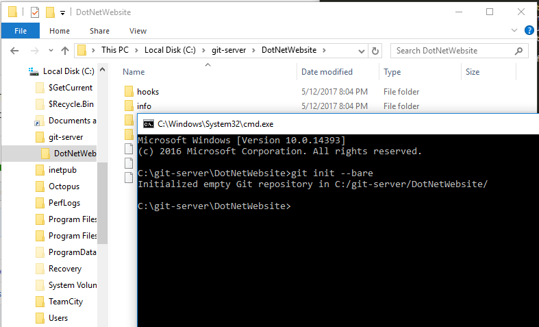
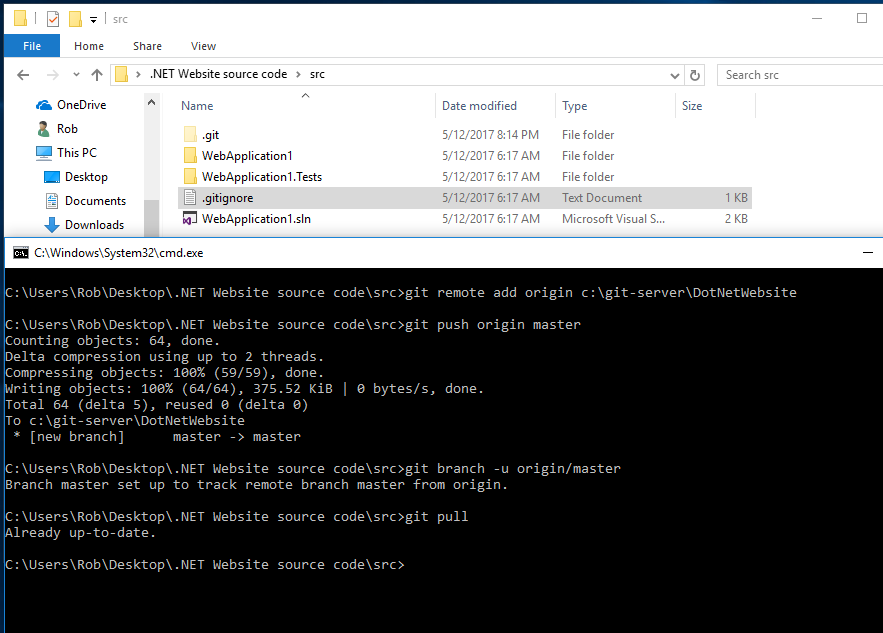

GIT SERVER
==========

For production use, you'll look to [GitHub](https://www.github.com/), [BitBucket](https://www.bitbucket.com), Azure DevOps, or another cloud provider.  Or perhaps you'd like to run Git on-premise with servers like [WebGit.NET](https://github.com/otac0n/WebGitNet) or any of the servers listed [here](http://stackoverflow.com/questions/5507489/git-server-like-github)

For this demo, we'll just use a local folder containing a bare git repository.

Create
------

1. Create a new folder at `C:\git-server`.

2. Create a folder named `DotNetWebsite` inside `C:\git-server`.

3. Open a terminal in this folder and run `git init --bare`.

   

4. Close the terminal.

Configure
---------

1. Open a command window inside the source code project you created in Step 1: CREATE .NET SOLUTION.

2. Type `git remote add origin c:\git-server\DotNetWebsite`.  This creates a link from our project to the "server".

3. Type `git push origin master`.  This pushes the source code to the server.

4. Type `git branch -u origin/master`.  This links the current local branch to the server's branch.

   

Test it out
-----------

1. Type `git pull`.

2. If you get no errors and it says `Already up to date`, it works.
